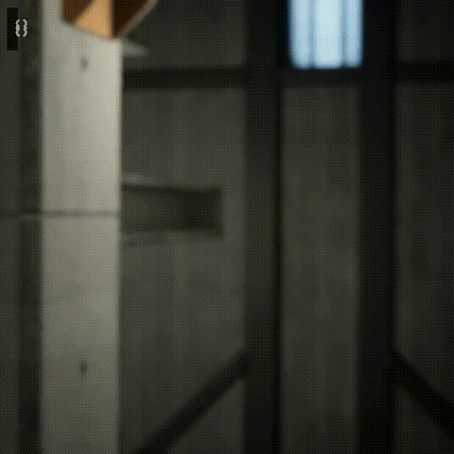
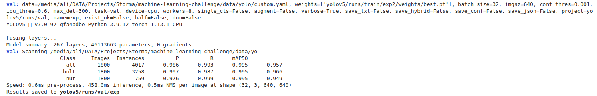
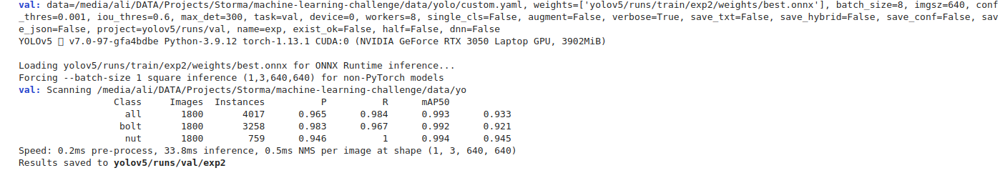
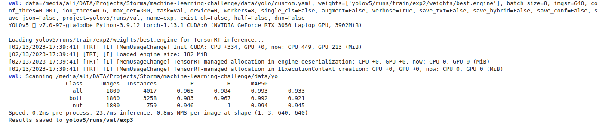

# Custom-YOLOv5-Object-Detection-and-StrongSORT-Tracking
> The objective of this project is to create a pipeline that can predict and track the number of nuts and bolts that have fallen through the frame of the provided video snippets with high accuracy using YOLOv5 and StrongSORT.

Given 4 minutes of video for training and 2 minutes of video for validation and another 2 minutes of video for testing. The [video files](https://github.com/Stroma-Vision/machine-learning-challenge/releases/download/v0.1/challenge.zip) are synthetically generated 640x640 frames in 30FPS, each frame is accurately labeled in the [COCO](https://opencv.org/introduction-to-the-coco-dataset/) format with an additional field named `track_id`.

Image below shows the output of pipeline.



## Data

**Folder Structure**
```bash

data/
├── coco
│   ├── annotations
│   │	├── instances_test.json
│   │	├── instances_train.json
│   │	└── instances_val.json
│   └── images
│       ├── test
│       │   └── test.mp4
│       ├── train
│       │   └── train.mp4
│       └── val
│           └── val.mp4
└── yolo
    ├── test
    │   ├── images
    │   └── labels
    ├── train
    │   ├── images
    │   └── labels
    ├── val
    │   ├── images
    │   └── labels   
    ├── class.names
    └── custom.yaml
    
    
19 directories
```
### COCO Format

Each annotation contains a `track_id` section. With the following schema:

**JSON Schema**

```json
"annotations":[
    {
        "id": int,
        "image_id": int, (#frame)
        "category_id": int,
        "segmentation": RLE,
        "area": float,
        "bbox": [x,y,width,height],
        "iscrowd": 0,
        "track_id": int,
    },
    ...
]
```

### YOLO Format

Each annotation is described by one row inside the *.txt file per image (if no objects in image, no *.txt file is required). The *.txt file specifications are:

```
<object-class> <x_center> <y_center> <width> <height>
<object-class> <x_center> <y_center> <width> <height>
...
<object-class> <x_center> <y_center> <width> <height>
```
- One row per object
- Each row has the following format : `<object-class> <x_center> <y_center> <width> <height>`
- Box coordinates must be in normalized xywh format (from 0 - 1). If your boxes are in pixels, divide x_center and width by image width, and y_center and height by image height.
- Class numbers are zero-indexed (start from 0).

## Helpers (Data Preparation & Conversion)

**Folder Structure**
```bash
helpers/
├── convert_coco_to_yolo.ipynb
├── convert_video_to_images.ipynb
└── speedup_video.py

0 directories, 3 files
```
- You can use `convert_coco_to_yolo.ipynb` notebook to convert annotations from COCO to YOLO data format.
- You can use `convert_video_to_images.ipynb` notebook to extract frames from the raw videos, so that the frames can be used with the proper annotations in training of the custom model.
- You can use `speedup_video.py` script to speed up your video.

## Pipeline
You can use the `pipeline.ipynb` notebook for the following:
- Train & evaluate a custom YOLOv5 object detection model.
- Make inferences on images/videos using the trained YOLOv5 model.
- Make inferences on videos using the StrongSORT tracking algorithm with the trained YOLOv5 model.
- Optimize and export the trained YOLOv5 Model to other formats like TensorRT, ONNX runtime and a comparison of each 

## Results of YOLOv5 Object Detection Model
- Evaluation of PyTorch version 




- Evaluation of ONNX Runtime version 




- Evaluation of TensorRT version 



`Note: The above results represent the performance of the inference model on the validation dataset.`
